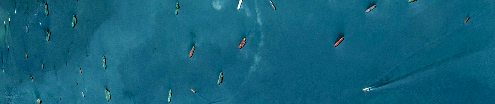

# Kaggle Airbus Ship Selection Challenge

This is the source code for my submission to the [Airbus Ship Selection Challenge hosted by Kaggle](https://www.kaggle.com/c/airbus-ship-detection). Placed 479th with an F2 score of 0.83313.

## Repository structure

- [`notebooks`](https://github.com/davidtvs/airbus-ship-detection/tree/master/notebooks): contains some tests of new features made in Jupyter notebooks (F-score, run-length encoding/decoding, Dice loss, etc.)
- [`src`](https://github.com/davidtvs/airbus-ship-detection/tree/master/src): code used for this submission.

## Dependencies

- Python 3
- pip
- `pip install -r requirements.txt`
